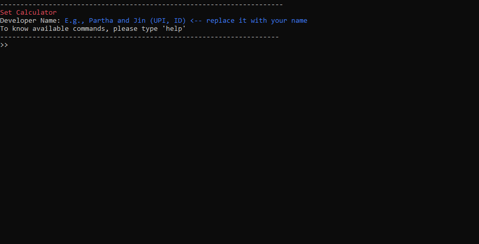

## graph_theory
compsys202 project which parses set theory graphs from text files and shows if the graph has transitive, symmetric, anti-symmetric and reflexive properties. also has dykstra's shortest path algorithm implemented.

